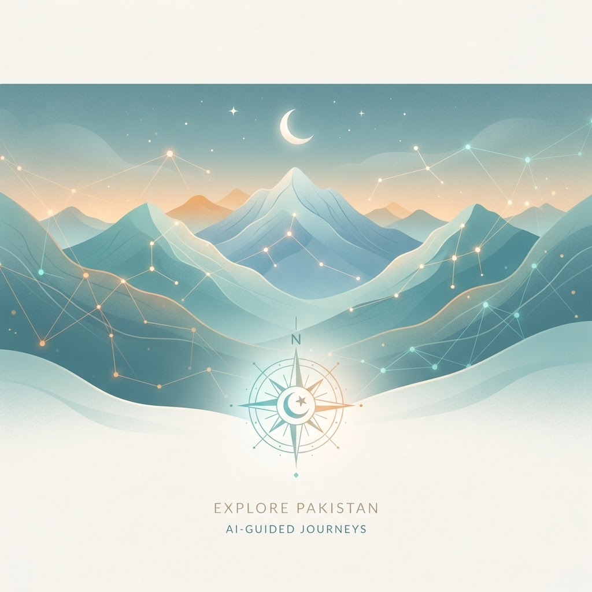
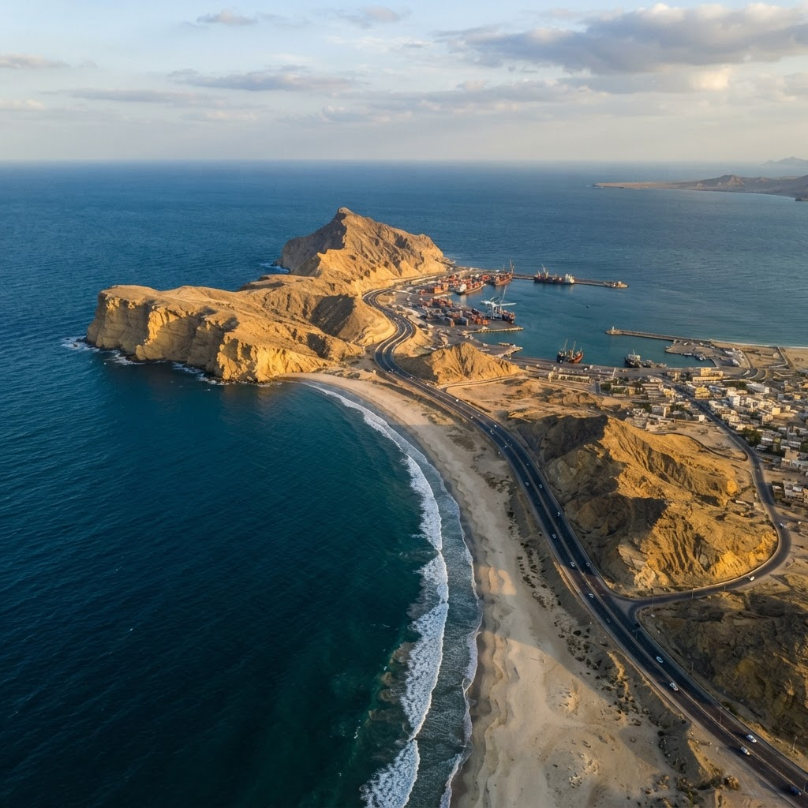

#  SmartSafar – AI Travel Planner & Digital Travel Companion

##  About SmartSafar

SmartSafar is an AI-powered travel planning web application designed to simplify travel planning for local and international travelers. Instead of searching multiple websites for destinations, budgets, maps, and travel information, SmartSafar brings everything together in one place.

The platform helps users create personalized travel itineraries, estimate travel budgets, explore destinations, and access essential travel information through an intelligent AI assistant.

### Problem It Solves

Planning a trip often requires switching between multiple websites for destination research, budgeting, maps, currency conversion, and itinerary creation. This process is time-consuming and confusing, especially for first-time travelers.

SmartSafar solves this problem by providing an all-in-one AI travel planning platform that generates customized travel plans based on the user's destination, budget, travel duration, and preferences.

### Target Users

* Tourists
* Students
* Families
* Solo travelers
* Business travelers
* Anyone planning domestic or international trips

#  Live Demo

**Live Website**

https://unified-digital-travel-pass-for-pakistan-e0z3b0c2x.vercel.app/
https://smartsafar.ploy.build/
#  Features

*  AI-powered travel itinerary generation
*  Worldwide destination planning
*  Travel budget estimation
*  Currency conversion
*  Google Maps integration
*  Destination exploration
*  Personalized day-by-day travel plans
*  Responsive design for desktop and mobile
*  Fast performance using Next.js

---

# AI Feature

SmartSafar uses Generative AI to create personalized travel itineraries based on user preferences.

The AI analyzes:

* Destination
* Trip duration
* Budget
* Travel style
* User preferences

and generates a structured travel plan with suggested activities and recommendations.

### AI System Prompt

The AI is instructed to:

> You are SmartSafar AI, an expert travel planning assistant. Generate realistic, personalized travel itineraries based on the user's destination, travel duration, budget, and travel preferences. Recommend attractions, transportation options, estimated costs, and daily activities. Present the itinerary in a clear day-by-day format while keeping recommendations practical and budget-aware.

---

#  Technologies Used

### Frontend

* Next.js
* React
* TypeScript
* Tailwind CSS

### AI

* Google Gemini API *(or update this if you switched to another model)*

### Maps

* Google Maps

### Deployment

* Vercel

### Version Control

* Git
* GitHub


##  Screenshots

### Home Page



---

### Islamabad


---

### Hunza


---

### Skardu


---

### Lahore


---

### Karachi


---

### Fairy Meadows


---

### Naran Kaghan


---

### Neelum Valley


---

### Murree


---

### Gwadar



---

### Mohenjo Daro


---

### Shalimar Gardens


---

### QR Scan


---

### Bus Booking


# How to Run the Project

Clone the repository

```bash
git clone YOUR_GITHUB_REPOSITORY_LINK
```

Navigate to the project

```bash
cd Unified-Digital-Travel-Pass-for-Pakistan
```

Install dependencies

```bash
npm install
```

Run the development server

```bash
npm run dev
```

Open your browser and visit

```
http://localhost:3000
```


# Project Structure

```
app/
components/
lib/
public/
package.json
next.config.mjs
```

# Future Improvements

* Hotel booking integration
* Flight booking integration
* Real-time weather forecasts
* Visa information
* Travel expense tracking
* Multi-language support
* AI chat assistant
* Offline itinerary support


# Developer

**Ayesha Umar**

BS Computer Science

Pakistan Institute of Engineering and Applied Sciences (PIEAS)


